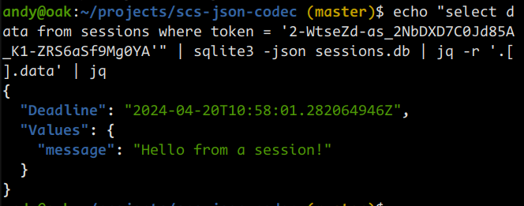

# scs-json-codec

This module provides a JSON codec for Alex Edwards' [SCS: HTTP Session Management for Go](https://github.com/alexedwards/scs/). It is not recommended for use in production but rather the codec is designed to be useful whilst developing locally.

SCS uses its default `GobCodec` which is more efficent and suitable for production. However, it is not human readable making it harder to work with during development.

The following screenshot shows the session data stored in the SQLite3 database using the default `GobCodec`. The session data is stored as a binary blob in the `data` column. There is no easy way to inspect the session data.


By encoding the session data as JSON it is easier to inspect the session data in the store.

# Example usage

There is a working example in the `example` directory that demonstrates its use with the sqlite3store. To run the example, first clone this repository and then run the following commands:

```shell
$ go run example/main.go
```

The example will start a server on `localhost:4000` with two routes:

- `/put` - This route will store a message in the session data.
- `/get` - This route will retrieve the message from the session data and display it.

The session data is stored in a SQLite3 database called `sessions.db`.

You should install the SQLite3 command line tool to inspect the database. The latest sqlite3 command line tool can be downloaded from the [SQLite Download Page](https://www.sqlite.org/download.html). VSCode also has extensions `SQLite` and `SQLite View` that can be used to inspect the database.

```shell
$ sqlite3 sessions.db

```

The following SQL commands can be used to create the `sessions` table:

```sql
CREATE TABLE sessions (
	token TEXT PRIMARY KEY,
	data BLOB NOT NULL,
	expiry REAL NOT NULL
);

CREATE INDEX sessions_expiry_idx ON sessions(expiry);
```

# Inspecting data

Visit http://localhost:4000/put to store a message in the session data. Visit http://localhost:4000/get to retrieve the message from the session data.

Using the browser developer tools, you can inspect the session data stored in the browser cookie. In the following screenshot, the session data is stored in the SCS default `session` cookie. The value here is `2-WtseZd-as_2NbDXD7C0Jd85A_K1-ZRS6aSf9Mg0YA`. Replace this value with the one in your browser cookie when running the following SQL commands.


The session data is stored as a JSON string in the `data` column. The following SQL command can be used to retrieve the session data:

```sql
SELECT token, data, datetime(expiry, 'julianday') FROM sessions;
```


The following command can be used to retrieve the session data for a specific token:

```sql
SELECT token, data, datetime(expiry, 'julianday') FROM sessions WHEN token = '<token>';
```

Or, directly from your terminal, you can use the following command to retrieve the session data for a specific token:

```shell
echo "SELECT data FROM sessions WHERE token = '2-WtseZd-as_2NbDXD7C0Jd85A_K1-ZRS6aSf9Mg0YA'" | sqlite3 -json sessions.db | jq -r '.[].data' | jq
```




# Example code

```go
// Initialize a new session manager and configure the session lifetime.
	sessionManager := scs.New()

	// Open a SQLite3 database.
	db, err := sql.Open("sqlite3", "sessions.db")
	if err != nil {
		return err
	}
	defer db.Close()

	// Initialize a new session manager and configure it to use sqlite3store as the session store.
	sessionManager = scs.New()
	sessionManager.Store = sqlite3store.New(db)
	sessionManager.Lifetime = 24 * time.Hour

  // *** Set the codec to JSONCodec ***
	sessionManager.Codec = codec.JSONCodec{}

	mux := http.NewServeMux()
	mux.HandleFunc("/put", func(w http.ResponseWriter, r *http.Request) {
		// Store a new key and value in the session data.
		sessionManager.Put(r.Context(), "message", "Hello from a session!")
	})

	mux.HandleFunc("/get", func(w http.ResponseWriter, r *http.Request) {
		// Use the GetString helper to retrieve the string value associated with a
		// key. The zero value is returned if the key does not exist.
		msg := sessionManager.GetString(r.Context(), "message")
		_, _ = io.WriteString(w, msg)
	})

	// Wrap your handlers with the LoadAndSave() middleware.
	if err := http.ListenAndServe(":4000", sessionManager.LoadAndSave(mux)); err != nil {
		return err
	}

	return nil
}
```


# Trouble shooting

## no such table: sessions

If you encounter the following error messages, it is likely that the `sessions` table has not been created in the database.


To fix this, paste the SQL commands to create the `sessions` table into the SQLite3 command line tool.


# License

This code is released under the MIT License. See LICENSE for more information.
